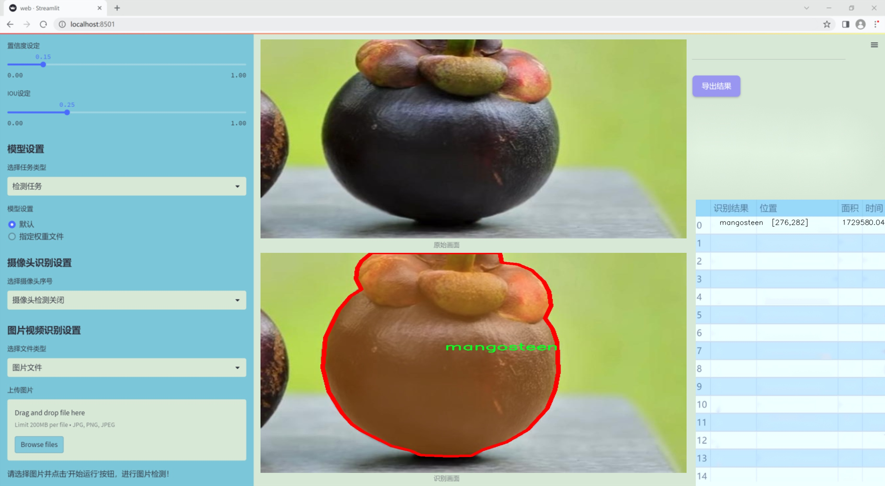
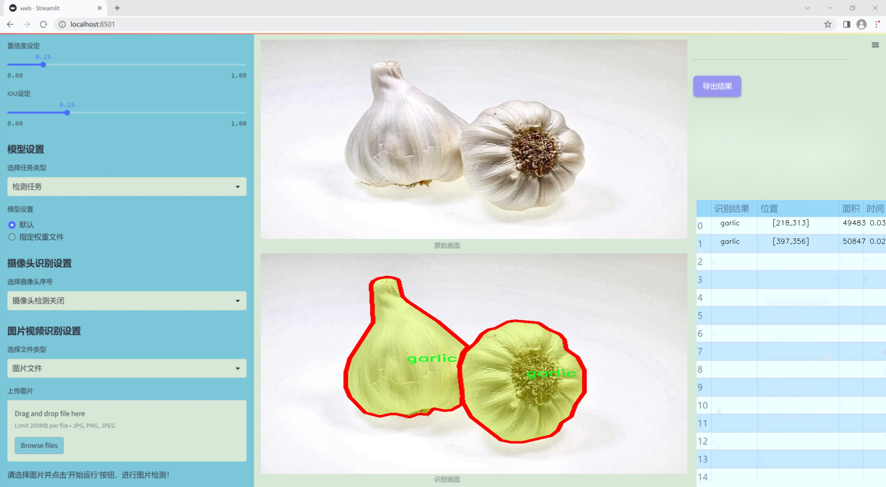
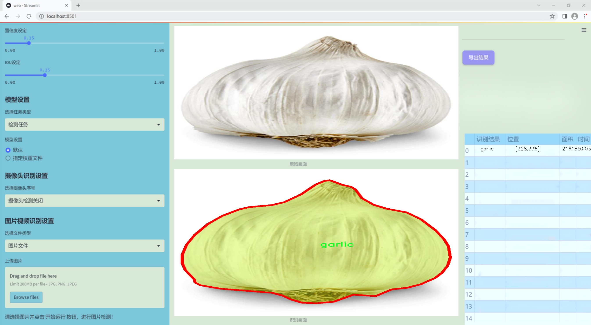

### 1.背景意义

研究背景与意义

随着全球人口的不断增长和城市化进程的加快，农业生产面临着前所未有的挑战。如何提高农业生产效率、减少人力成本以及实现智能化管理，成为了现代农业发展的重要课题。在此背景下，计算机视觉技术的快速发展为农业领域的智能化提供了新的解决方案。尤其是实例分割技术，能够对图像中的不同对象进行精确的分割和识别，为农业产品的分类、监测和管理提供了强有力的支持。

本研究旨在基于改进的YOLOv11模型，构建一个高效的蔬菜水果实例分割系统。该系统将针对包括甜椒、胡萝卜、大蒜、山竹、菠萝、火龙果、草莓和西红柿在内的八种常见蔬菜水果进行精确的实例分割。通过使用包含2000张图像的数据集，系统能够有效地识别和分割不同类别的蔬菜水果，为农业生产的智能化管理提供数据支持。

实例分割技术的应用，不仅可以提高农产品的分类精度，还能够在采摘、运输和销售等环节中实现更高效的管理。例如，通过对果蔬的实时监测，农民可以及时了解作物的生长状态，合理安排采摘时间，从而提高产量和质量。此外，实例分割技术还可以应用于病虫害监测，帮助农民及时发现问题并采取相应措施，减少损失。

综上所述，基于改进YOLOv11的蔬菜水果实例分割系统的研究，不仅具有重要的理论意义，也具有广泛的应用前景。通过该系统的实现，将为现代农业的智能化转型提供有力的技术支持，推动农业生产的可持续发展。

### 2.视频效果

[2.1 视频效果](https://www.bilibili.com/video/BV1ysCcYoEch/)

### 3.图片效果







##### [项目涉及的源码数据来源链接](https://kdocs.cn/l/cszuIiCKVNis)**

注意：本项目提供训练的数据集和训练教程,由于版本持续更新,暂不提供权重文件（best.pt）,请按照6.训练教程进行训练后实现上图演示的效果。

### 4.数据集信息

##### 4.1 本项目数据集类别数＆类别名

nc: 8
names: ['bell pepper', 'carrot', 'garlic', 'mangosteen', 'pineapple', 'pitaya', 'strawberry', 'tomato']


该项目为【图像分割】数据集，请在【训练教程和Web端加载模型教程（第三步）】这一步的时候按照【图像分割】部分的教程来训练

##### 4.2 本项目数据集信息介绍

本项目数据集信息介绍

本项目旨在开发一个改进版的YOLOv11实例分割系统，专注于蔬菜和水果的精确识别与分割。为实现这一目标，我们构建了一个专门的数据集，涵盖了八种不同的蔬菜和水果类别，具体包括：甜椒、胡萝卜、大蒜、山竹、菠萝、火龙果、草莓和西红柿。这些类别的选择不仅考虑了它们在市场上的普遍性和经济价值，还兼顾了它们在不同生长阶段和不同环境下的外观特征，从而确保数据集的多样性和代表性。

数据集中每个类别均包含丰富的图像样本，这些样本经过精心挑选，确保在光照、角度和背景等方面的多样性，以提高模型的泛化能力。每张图像都经过标注，包含了物体的边界框和分割掩码，旨在为YOLOv11模型提供高质量的训练数据。这种高质量的标注不仅能够帮助模型更好地学习各类蔬菜和水果的特征，还能有效提高其在实际应用中的识别精度。

在数据集的构建过程中，我们还特别关注了图像的采集环境，确保样本来源于不同的地理区域和气候条件，以增强模型在各种实际场景下的适应性。此外，数据集还包含了不同成熟度和损伤程度的样本，以模拟真实世界中可能遇到的各种情况。这一系列的设计理念旨在通过丰富的数据支持，提升YOLOv11在蔬菜水果实例分割任务中的表现，使其能够在实际应用中更为高效和准确。通过这一数据集的训练，我们期望实现对蔬菜和水果的精准分割，为农业生产、食品安全及相关领域提供有力的技术支持。


### 5.全套项目环境部署视频教程（零基础手把手教学）

[5.1 所需软件PyCharm和Anaconda安装教程（第一步）](https://www.bilibili.com/video/BV1BoC1YCEKi/?spm_id_from=333.999.0.0&vd_source=bc9aec86d164b67a7004b996143742dc)


[5.2 安装Python虚拟环境创建和依赖库安装视频教程（第二步）](https://www.bilibili.com/video/BV1ZoC1YCEBw?spm_id_from=333.788.videopod.sections&vd_source=bc9aec86d164b67a7004b996143742dc)

### 6.改进YOLOv11训练教程和Web_UI前端加载模型教程（零基础手把手教学）

[6.1 改进YOLOv11训练教程和Web_UI前端加载模型教程（第三步）](https://www.bilibili.com/video/BV1BoC1YCEhR?spm_id_from=333.788.videopod.sections&vd_source=bc9aec86d164b67a7004b996143742dc)


按照上面的训练视频教程链接加载项目提供的数据集，运行train.py即可开始训练



     Epoch   gpu_mem       box       obj       cls    labels  img_size
     1/200     20.8G   0.01576   0.01955  0.007536        22      1280: 100%|██████████| 849/849 [14:42<00:00,  1.04s/it]
               Class     Images     Labels          P          R     mAP@.5 mAP@.5:.95: 100%|██████████| 213/213 [01:14<00:00,  2.87it/s]
                 all       3395      17314      0.994      0.957      0.0957      0.0843

     Epoch   gpu_mem       box       obj       cls    labels  img_size
     2/200     20.8G   0.01578   0.01923  0.007006        22      1280: 100%|██████████| 849/849 [14:44<00:00,  1.04s/it]
               Class     Images     Labels          P          R     mAP@.5 mAP@.5:.95: 100%|██████████| 213/213 [01:12<00:00,  2.95it/s]
                 all       3395      17314      0.996      0.956      0.0957      0.0845

     Epoch   gpu_mem       box       obj       cls    labels  img_size
     3/200     20.8G   0.01561    0.0191  0.006895        27      1280: 100%|██████████| 849/849 [10:56<00:00,  1.29it/s]
               Class     Images     Labels          P          R     mAP@.5 mAP@.5:.95: 100%|███████   | 187/213 [00:52<00:00,  4.04it/s]
                 all       3395      17314      0.996      0.957      0.0957      0.0845


###### [项目数据集下载链接](https://kdocs.cn/l/cszuIiCKVNis)

### 7.原始YOLOv11算法讲解


其实到了YOLOV11 基本创新点就不太多了，主要就是大家互相排列组合复用不同的网络模块、损失函数和样本匹配策略，需要注意YOLO V5、V8 V11
都是1个公司的，其余的个人建议看看V8的，剩下的了解就好。

V11支持多种视觉任务：物体检测、实例分割、图像分类、姿态估计和定向物体检测（OBB）。

##### YOLOv11
基本和YOLOV8同源，甚至git目前都是1个，部分代码注释还是YOLOV8的，所以建议先看我写的YOLOV8相关博客，对比YOLOV8主要涉及到：

*backbone 中的使用C2f模块 变为 c3k2 模块。

*backbone 中的最后一层（sppf层）后增加了C2PSA模块。

*head 解耦头中的分类检测头两个Conv 变为 DWConv。

整体技术而言：

*backbone 使用了C2K2模块+最后SPPF模块级联C2PSA模块；

*neck 使用PAN结构，并且里面也使用C3K2模块；

*head使用了anchor-free + Decoupled-head，其中回归头使用正常的卷积，分类头使用DWConv；

*损失函数使用了分类BCE、回归CIOU + VFL的组合；

*框匹配策略由静态匹配改为了Task-Aligned Assigner匹配方式；

*训练策略没有提及，其中YOLOV8可以参考如下最后 10 个 epoch 关闭 Mosaic 的操作、训练总 epoch 数从 300 提升到了 500。

##### 主要思路


配置文件：[ultralytics/ultralytics/cfg/models/11/yolo11.yaml at main ·
ultralytics/ultralytics ·
GitHub](https://github.com/ultralytics/ultralytics/blob/main/ultralytics/cfg/models/11/yolo11.yaml
"ultralytics/ultralytics/cfg/models/11/yolo11.yaml at main ·
ultralytics/ultralytics · GitHub")

解析函数：[ultralytics/ultralytics/nn/tasks.py at main · ultralytics/ultralytics ·
GitHub](https://github.com/ultralytics/ultralytics/blob/main/ultralytics/nn/tasks.py#L934
"ultralytics/ultralytics/nn/tasks.py at main · ultralytics/ultralytics ·
GitHub")


##### 具体细节

##### input

输入要求以及预处理，可选项比较多，可以参考这个配置文件：[ultralytics/ultralytics/cfg/default.yaml at main
· ultralytics/ultralytics ·
GitHub](https://github.com/ultralytics/ultralytics/blob/main/ultralytics/cfg/default.yaml
"ultralytics/ultralytics/cfg/default.yaml at main · ultralytics/ultralytics ·
GitHub") 的Hyperparameters 部分。

基础输入仍然为640*640。预处理就是熟悉的letterbox（根据参数配置可以为不同的缩放填充模式，主要用于resize到640）+
转换rgb、chw、int8(0-255)->float（0-1），注意没有归一化操作。需要注意的是作者实现的mosaic和网上看到的不同，对比如下图（左边网上版本，右边是YOLO的实现）。并且作者添加了在最后10轮关闭mosaic增强（YOLOV8开始支持，具体原因个人的经验如我的这篇文章：yolov5
mosaic相关，关闭参数在 Train settings 部分的close_mosaic 选项）


##### backbone

主干网络以及改进

这里不去特意强调对比YOLOv5、V8等等的改进，因为各个系列都在疯狂演进，个人认为没必要花费时间看差异，着重看看一些比较重要的模块即可。源代码：

大多数模块：[ultralytics/ultralytics/nn/modules/block.py at main ·
ultralytics/ultralytics ·
GitHub](https://github.com/ultralytics/ultralytics/blob/main/ultralytics/nn/modules/block.py
"ultralytics/ultralytics/nn/modules/block.py at main · ultralytics/ultralytics
· GitHub")

head 部分：[ultralytics/ultralytics/nn/modules/head.py at main ·
ultralytics/ultralytics ·
GitHub](https://github.com/ultralytics/ultralytics/blob/main/ultralytics/nn/modules/head.py
"ultralytics/ultralytics/nn/modules/head.py at main · ultralytics/ultralytics
· GitHub")

串联模块构造网络：[ultralytics/ultralytics/nn/tasks.py at main ·
ultralytics/ultralytics ·
GitHub](https://github.com/ultralytics/ultralytics/blob/main/ultralytics/nn/tasks.py
"ultralytics/ultralytics/nn/tasks.py at main · ultralytics/ultralytics ·
GitHub")

##### 1）CBS 模块（后面叫做Conv）

就是pytorch 自带的conv + BN +SiLU，这里对应上面的配置文件的Conv 的 args 比如[64, 3, 2] 就是 conv2d
的c2=64、k=3、 s =2、c1 自动为上一层参数、p 为自动计算，真实需要计算scales 里面的with 和 max_channels 缩放系数。

这里连续使用两个3*3卷积stride为2的CBS模块直接横竖各降低了4倍分辨率（整体变为原来1/16）。这个还是比较猛的，敢在如此小的感受野下连续两次仅仅用一层卷积就下采样,当然作为代价它的特征图还是比较厚的分别为16、32。


    
    
        class Conv(nn.Module):
        """Standard convolution with args(ch_in, ch_out, kernel, stride, padding, groups, dilation, activation)."""
    
        default_act = nn.SiLU()  # default activation
    
        def __init__(self, c1, c2, k=1, s=1, p=None, g=1, d=1, act=True):
            """Initialize Conv layer with given arguments including activation."""
            super().__init__()
            self.conv = nn.Conv2d(c1, c2, k, s, autopad(k, p, d), groups=g, dilation=d, bias=False)
            self.bn = nn.BatchNorm2d(c2)
            self.act = self.default_act if act is True else act if isinstance(act, nn.Module) else nn.Identity()
    
        def forward(self, x):
            """Apply convolution, batch normalization and activation to input tensor."""
            return self.act(self.bn(self.conv(x)))
    
        def forward_fuse(self, x):
            """Perform transposed convolution of 2D data."""
            return self.act(self.conv(x))

##### 2）c3k2 模块

##### Bottleneck

有两种结构，需要参数shortcut和两个conv的宽度是否相同来控制。

##### C3 & C3K

都是CSP bottleneck module with 3 convolutions, C3 代表3个卷积层，
K代表其中bottleneck中的卷积核为支持自定义，其实这里c3k作者使用的默认的3*3卷积核也就等同于使用c3(c3是3*3卷积核)。

##### c2f & c3k2

其实也就是仿照YOLOv7 的ELAN
结构，通过更多的分支夸层链接，丰富了模型的梯度流。C3K2模块其实就是C2F模块转变出来的，它代码中有一个设置，就是当c3k这个参数为FALSE的时候，C3K2模块就是C2F模块，也就是说它的Bottleneck是普通的Bottleneck；反之当它为true的时候，将Bottleneck模块替换成C3K模块。模块中存在
Split 等操作对特定硬件部署没有之前那么友好了。需要针对自己的硬件进行测试看对最终推理速度的影响。

可视化关系如下，这里需要注意配置文件中的参数，比如21行[-1, 2, C3k2, [512, False, 0.25]]
512代表宽度、false代表是否使用shortcut、0.25代表c2f的宽度缩放。也就是第一个Conv的输出宽度。


源代码如下:

    
    
    class Bottleneck(nn.Module):
        """Standard bottleneck."""
    
        def __init__(self, c1, c2, shortcut=True, g=1, k=(3, 3), e=0.5):
            """Initializes a standard bottleneck module with optional shortcut connection and configurable parameters."""
            super().__init__()
            c_ = int(c2 * e)  # hidden channels
            self.cv1 = Conv(c1, c_, k[0], 1)
            self.cv2 = Conv(c_, c2, k[1], 1, g=g)
            self.add = shortcut and c1 == c2
    
        def forward(self, x):
            """Applies the YOLO FPN to input data."""
            return x + self.cv2(self.cv1(x)) if self.add else self.cv2(self.cv1(x))
    
    class C3(nn.Module):
        """CSP Bottleneck with 3 convolutions."""
    
        def __init__(self, c1, c2, n=1, shortcut=True, g=1, e=0.5):
            """Initialize the CSP Bottleneck with given channels, number, shortcut, groups, and expansion values."""
            super().__init__()
            c_ = int(c2 * e)  # hidden channels
            self.cv1 = Conv(c1, c_, 1, 1)
            self.cv2 = Conv(c1, c_, 1, 1)
            self.cv3 = Conv(2 * c_, c2, 1)  # optional act=FReLU(c2)
            self.m = nn.Sequential(*(Bottleneck(c_, c_, shortcut, g, k=((1, 1), (3, 3)), e=1.0) for _ in range(n)))
    
        def forward(self, x):
            """Forward pass through the CSP bottleneck with 2 convolutions."""
            return self.cv3(torch.cat((self.m(self.cv1(x)), self.cv2(x)), 1))
    
    class C3k(C3):
        """C3k is a CSP bottleneck module with customizable kernel sizes for feature extraction in neural networks."""
    
        def __init__(self, c1, c2, n=1, shortcut=True, g=1, e=0.5, k=3):
            """Initializes the C3k module with specified channels, number of layers, and configurations."""
            super().__init__(c1, c2, n, shortcut, g, e)
            c_ = int(c2 * e)  # hidden channels
            # self.m = nn.Sequential(*(RepBottleneck(c_, c_, shortcut, g, k=(k, k), e=1.0) for _ in range(n)))
            self.m = nn.Sequential(*(Bottleneck(c_, c_, shortcut, g, k=(k, k), e=1.0) for _ in range(n)))
    
    class C2f(nn.Module):
        """Faster Implementation of CSP Bottleneck with 2 convolutions."""
    
        def __init__(self, c1, c2, n=1, shortcut=False, g=1, e=0.5):
            """Initializes a CSP bottleneck with 2 convolutions and n Bottleneck blocks for faster processing."""
            super().__init__()
            self.c = int(c2 * e)  # hidden channels
            self.cv1 = Conv(c1, 2 * self.c, 1, 1)
            self.cv2 = Conv((2 + n) * self.c, c2, 1)  # optional act=FReLU(c2)
            self.m = nn.ModuleList(Bottleneck(self.c, self.c, shortcut, g, k=((3, 3), (3, 3)), e=1.0) for _ in range(n))
    
        def forward(self, x):
            """Forward pass through C2f layer."""
            y = list(self.cv1(x).chunk(2, 1))
            y.extend(m(y[-1]) for m in self.m)
            return self.cv2(torch.cat(y, 1))
    
        def forward_split(self, x):
            """Forward pass using split() instead of chunk()."""
            y = list(self.cv1(x).split((self.c, self.c), 1))
            y.extend(m(y[-1]) for m in self.m)
            return self.cv2(torch.cat(y, 1))
    
    class C3k2(C2f):
        """Faster Implementation of CSP Bottleneck with 2 convolutions."""
    
        def __init__(self, c1, c2, n=1, c3k=False, e=0.5, g=1, shortcut=True):
            """Initializes the C3k2 module, a faster CSP Bottleneck with 2 convolutions and optional C3k blocks."""
            super().__init__(c1, c2, n, shortcut, g, e)
            self.m = nn.ModuleList(
                C3k(self.c, self.c, 2, shortcut, g) if c3k else Bottleneck(self.c, self.c, shortcut, g) for _ in range(n)
            )

##### 3）sppf 模块

对比spp，将简单的并行max pooling 改为串行+并行的方式。对比如下（左边是SPP，右边是SPPF）：


    
    
        class SPPF(nn.Module):
        # Spatial Pyramid Pooling - Fast (SPPF) layer for YOLOv5 by Glenn Jocher
        def __init__(self, c1, c2, k=5):  # equivalent to SPP(k=(5, 9, 13))
            super().__init__()
            c_ = c1 // 2  # hidden channels
            self.cv1 = Conv(c1, c_, 1, 1)
            self.cv2 = Conv(c_ * 4, c2, 1, 1)
            self.m = nn.MaxPool2d(kernel_size=k, stride=1, padding=k // 2)
    
        def forward(self, x):
            x = self.cv1(x)
            with warnings.catch_warnings():
                warnings.simplefilter('ignore')  # suppress torch 1.9.0 max_pool2d() warning
                y1 = self.m(x)
                y2 = self.m(y1)
                return self.cv2(torch.cat((x, y1, y2, self.m(y2)), 1))

##### 4）C2PSA 模块

C2PSA它结合了PSA(Pointwise Spatial
Attention)块，用于增强特征提取和注意力机制。下面的图建议从左到右看，这样才能更有条理的理解，其实PSA个人感觉就是仿着VIT
的Attention来做的，是把输入C2PSA的特征图的h*w 看做VIT 的path数（也可以理解为NLP中token 个数），特征图的channel
数看做VIT特征维度（CNN的宽度，或者理解为NLP中token
编码后的特征维度），然后计算出QKV（这里需要注意第四幅图的QKV是值，不是操作，所以标注成了圆角矩形，这里是为了大家好理解），这里的Attention其实是在h*w维度计算空间Attention，个人感觉是强制给了全局感受野，并且并联了一个3*3的深度可分离卷积的单空间部分，就是仅在每一个特征图上进行3*3卷积，具体实现是通过pytorch
conv2d 的
group参数设置为特征图的通道数。特别的关于Conv的参数分别为：输入通道数、输出通道数、卷积核尺寸、pad尺寸、group数、是否有激活函数（默认silu）。图中的最后一幅省略了一些细节，可以参考源码。

注意区别C2fPSA，C2fPSA才是对 C2f 模块的扩展，通过在标准 C2f 模块中引入 PSA
块，C2fPSA实现了更强大的注意力机制，从而提高了模型对重要特征的捕捉能力。作者实现了该模块但最终没有使用。


涉及的源码：

    
    
    class Attention(nn.Module):
        """
        Attention module that performs self-attention on the input tensor.
    
        Args:
            dim (int): The input tensor dimension.
            num_heads (int): The number of attention heads.
            attn_ratio (float): The ratio of the attention key dimension to the head dimension.
    
        Attributes:
            num_heads (int): The number of attention heads.
            head_dim (int): The dimension of each attention head.
            key_dim (int): The dimension of the attention key.
            scale (float): The scaling factor for the attention scores.
            qkv (Conv): Convolutional layer for computing the query, key, and value.
            proj (Conv): Convolutional layer for projecting the attended values.
            pe (Conv): Convolutional layer for positional encoding.
        """
    
        def __init__(self, dim, num_heads=8, attn_ratio=0.5):
            """Initializes multi-head attention module with query, key, and value convolutions and positional encoding."""
            super().__init__()
            self.num_heads = num_heads
            self.head_dim = dim // num_heads
            self.key_dim = int(self.head_dim * attn_ratio)
            self.scale = self.key_dim**-0.5
            nh_kd = self.key_dim * num_heads
            h = dim + nh_kd * 2
            self.qkv = Conv(dim, h, 1, act=False)
            self.proj = Conv(dim, dim, 1, act=False)
            self.pe = Conv(dim, dim, 3, 1, g=dim, act=False)
    
        def forward(self, x):
            """
            Forward pass of the Attention module.
    
            Args:
                x (torch.Tensor): The input tensor.
    
            Returns:
                (torch.Tensor): The output tensor after self-attention.
            """
            B, C, H, W = x.shape
            N = H * W
            qkv = self.qkv(x)
            q, k, v = qkv.view(B, self.num_heads, self.key_dim * 2 + self.head_dim, N).split(
                [self.key_dim, self.key_dim, self.head_dim], dim=2
            )
    
            attn = (q.transpose(-2, -1) @ k) * self.scale
            attn = attn.softmax(dim=-1)
            x = (v @ attn.transpose(-2, -1)).view(B, C, H, W) + self.pe(v.reshape(B, C, H, W))
            x = self.proj(x)
            return x
    
    class PSABlock(nn.Module):
        """
        PSABlock class implementing a Position-Sensitive Attention block for neural networks.
    
        This class encapsulates the functionality for applying multi-head attention and feed-forward neural network layers
        with optional shortcut connections.
    
        Attributes:
            attn (Attention): Multi-head attention module.
            ffn (nn.Sequential): Feed-forward neural network module.
            add (bool): Flag indicating whether to add shortcut connections.
    
        Methods:
            forward: Performs a forward pass through the PSABlock, applying attention and feed-forward layers.
    
        Examples:
            Create a PSABlock and perform a forward pass
            >>> psablock = PSABlock(c=128, attn_ratio=0.5, num_heads=4, shortcut=True)
            >>> input_tensor = torch.randn(1, 128, 32, 32)
            >>> output_tensor = psablock(input_tensor)
        """
    
        def __init__(self, c, attn_ratio=0.5, num_heads=4, shortcut=True) -> None:
            """Initializes the PSABlock with attention and feed-forward layers for enhanced feature extraction."""
            super().__init__()
    
            self.attn = Attention(c, attn_ratio=attn_ratio, num_heads=num_heads)
            self.ffn = nn.Sequential(Conv(c, c * 2, 1), Conv(c * 2, c, 1, act=False))
            self.add = shortcut
    
        def forward(self, x):
            """Executes a forward pass through PSABlock, applying attention and feed-forward layers to the input tensor."""
            x = x + self.attn(x) if self.add else self.attn(x)
            x = x + self.ffn(x) if self.add else self.ffn(x)
            return x
        
    class C2PSA(nn.Module):
        """
        C2PSA module with attention mechanism for enhanced feature extraction and processing.
    
        This module implements a convolutional block with attention mechanisms to enhance feature extraction and processing
        capabilities. It includes a series of PSABlock modules for self-attention and feed-forward operations.
    
        Attributes:
            c (int): Number of hidden channels.
            cv1 (Conv): 1x1 convolution layer to reduce the number of input channels to 2*c.
            cv2 (Conv): 1x1 convolution layer to reduce the number of output channels to c.
            m (nn.Sequential): Sequential container of PSABlock modules for attention and feed-forward operations.
    
        Methods:
            forward: Performs a forward pass through the C2PSA module, applying attention and feed-forward operations.
    
        Notes:
            This module essentially is the same as PSA module, but refactored to allow stacking more PSABlock modules.
    
        Examples:
            >>> c2psa = C2PSA(c1=256, c2=256, n=3, e=0.5)
            >>> input_tensor = torch.randn(1, 256, 64, 64)
            >>> output_tensor = c2psa(input_tensor)
        """
    
        def __init__(self, c1, c2, n=1, e=0.5):
            """Initializes the C2PSA module with specified input/output channels, number of layers, and expansion ratio."""
            super().__init__()
            assert c1 == c2
            self.c = int(c1 * e)
            self.cv1 = Conv(c1, 2 * self.c, 1, 1)
            self.cv2 = Conv(2 * self.c, c1, 1)
    
            self.m = nn.Sequential(*(PSABlock(self.c, attn_ratio=0.5, num_heads=self.c // 64) for _ in range(n)))
    
        def forward(self, x):
            """Processes the input tensor 'x' through a series of PSA blocks and returns the transformed tensor."""
            a, b = self.cv1(x).split((self.c, self.c), dim=1)
            b = self.m(b)
            return self.cv2(torch.cat((a, b), 1))

##### 3、neck & head

##### 1）检测头

YOLOV11 Head 部分和YOLOV8是近似的，所以简单对比YOLOV5、V8、V11。


如上面图，上边是YOLOV5 的结构，中是YOLOv8 的结构，下面是YOLOV11 结构

Yolov5: 检测和分类共用一个卷积（coupled head）并且是anchor based ,其 卷积输出为（5+N class）*3，其中
5为bbox 四个值（具体代表什么不同版本略有不同，官方git有说明，历史版本见 目标检测算法——YOLOV5 ）+ 一个obj 值
（是否有目标，这个是从YOLO V1 传承下来的，个人感觉有点绕和不合理，并且后面取消），N class 为类别数，3为anchor 的数量，默认是3个。

YOLOv8：检测和分类的卷积是解耦的（decoupled），如中图，上面一条卷积支路是回归框，框的特征图channel为4*regmax，关于这个regmax
后面我们详细的解释,并不是anchor；分类的channel 为类别数。

YOLOV11：检测和分类的卷积是解耦的（decoupled），如右图，上面一条卷积支路是回归框，框的特征图channel为4*regmax，关于这个regmax
后面我们详细的解释,并不是anchor；分类的channel 为类别数，分类使用深度可分离卷积替代常规卷积降低计算量。

源码部分如下

    
    
    class Detect(nn.Module):
        """YOLO Detect head for detection models."""
    
        dynamic = False  # force grid reconstruction
        export = False  # export mode
        end2end = False  # end2end
        max_det = 300  # max_det
        shape = None
        anchors = torch.empty(0)  # init
        strides = torch.empty(0)  # init
    
        def __init__(self, nc=80, ch=()):
            """Initializes the YOLO detection layer with specified number of classes and channels."""
            super().__init__()
            self.nc = nc  # number of classes
            self.nl = len(ch)  # number of detection layers
            self.reg_max = 16  # DFL channels (ch[0] // 16 to scale 4/8/12/16/20 for n/s/m/l/x)
            self.no = nc + self.reg_max * 4  # number of outputs per anchor
            self.stride = torch.zeros(self.nl)  # strides computed during build
            c2, c3 = max((16, ch[0] // 4, self.reg_max * 4)), max(ch[0], min(self.nc, 100))  # channels
            self.cv2 = nn.ModuleList(
                nn.Sequential(Conv(x, c2, 3), Conv(c2, c2, 3), nn.Conv2d(c2, 4 * self.reg_max, 1)) for x in ch
            )
            self.cv3 = nn.ModuleList(
                nn.Sequential(
                    nn.Sequential(DWConv(x, x, 3), Conv(x, c3, 1)),
                    nn.Sequential(DWConv(c3, c3, 3), Conv(c3, c3, 1)),
                    nn.Conv2d(c3, self.nc, 1),
                )
                for x in ch
            )
            self.dfl = DFL(self.reg_max) if self.reg_max > 1 else nn.Identity()
    
            if self.end2end:
                self.one2one_cv2 = copy.deepcopy(self.cv2)
                self.one2one_cv3 = copy.deepcopy(self.cv3)
    
        def forward(self, x):
            """Concatenates and returns predicted bounding boxes and class probabilities."""
            if self.end2end:
                return self.forward_end2end(x)
    
            for i in range(self.nl):
                x[i] = torch.cat((self.cv2[i](x[i]), self.cv3[i](x[i])), 1)
            if self.training:  # Training path
                return x
            y = self._inference(x)
            return y if self.export else (y, x)

因此主要的变化可以认为有三个：（1）coupled head -> decoupled head ；（2）obj 分支消失；（3）anchor
based——> anchor free ; 4) 深度可分离卷积。

（1）coupled head -> decoupled head

这个解耦操作，看YOLO x 的论文，约有1% 的提升。逻辑和实现都比较直观易懂，不再赘述。

（2）obj 分支消失；

这个其实我自己再看YOLO V1 的时候就有疑问，它存在的意义。后来人们发现，其实obj
的在训练和推理过程中存在逻辑不一致性。具体而言（摘自“<https://zhuanlan.zhihu.com/p/147691786>”）

A。用法不一致。训练的时候，分类和质量估计各自训练自个儿的，但测试的时候却又是乘在一起作为NMS score排序的依据，这个操作显然没有end-to-
end，必然存在一定的gap。（个人认为还好，就是两个监督信号）

B。对象不一致。借助Focal
Loss的力量，分类分支能够使得少量的正样本和大量的负样本一起成功训练，但是质量估计通常就只针对正样本训练。那么，对于one-
stage的检测器而言，在做NMS
score排序的时候，所有的样本都会将分类score和质量预测score相乘用于排序，那么必然会存在一部分分数较低的“负样本”的质量预测是没有在训练过程中有监督信号的，对于大量可能的负样本，他们的质量预测是一个未定义行为。这就很有可能引发这么一个情况：一个分类score相对低的真正的负样本，由于预测了一个不可信的极高的质量score，而导致它可能排到一个真正的正样本（分类score不够高且质量score相对低）的前面。问题一如图所示：


（3）anchor based——> anchor free

这里主要涉及怎么定义回归内容以及如何匹配GT框的问题。也就是如下：

##### 2）匹配策略

A。回归的内容当前版本就是回归的lftp四个值（这四个值是距离匹配到的anchor 点的距离值！不是图片的绝对位置）。后面推理阶段通过
dist2bbox函数转换为需要的格式：

[
https://github.com/ultralytics/ultralytics/blob/cc3c774bde86ffce694d202b7383da6cc1721c1b/ultralytics/nn/modules.py#L378](https://github.com/ultralytics/ultralytics/blob/cc3c774bde86ffce694d202b7383da6cc1721c1b/ultralytics/nn/modules.py#L378
"  
 https://github.com/ultralytics/ultralytics/blob/cc3c774bde86ffce694d202b7383da6cc1721c1b/ultralytics/nn/modules.py#L378")

[
https://github.com/ultralytics/ultralytics/blob/cc3c774bde86ffce694d202b7383da6cc1721c1b/ultralytics/yolo/utils/tal.py#L196](https://github.com/ultralytics/ultralytics/blob/cc3c774bde86ffce694d202b7383da6cc1721c1b/ultralytics/yolo/utils/tal.py#L196
"  
 https://github.com/ultralytics/ultralytics/blob/cc3c774bde86ffce694d202b7383da6cc1721c1b/ultralytics/yolo/utils/tal.py#L196")。

    
    
       def dist2bbox(distance, anchor_points, xywh=True, dim=-1):
        """Transform distance(ltrb) to box(xywh or xyxy)."""
        lt, rb = torch.split(distance, 2, dim)
        x1y1 = anchor_points - lt
        x2y2 = anchor_points + rb
        if xywh:
            c_xy = (x1y1 + x2y2) / 2
            wh = x2y2 - x1y1
            return torch.cat((c_xy, wh), dim)  # xywh bbox
        return torch.cat((x1y1, x2y2), dim)  # xyxy bbox

##### B.匹配策略

YOLOv5 采用静态的匹配策略，V8采用了动态的TaskAlignedAssigner，其余常见的动态匹配还有： YOLOX 的 simOTA、TOOD
的 TaskAlignedAssigner 和 RTMDet 的 DynamicSoftLabelAssigner。


TaskAligned使用分类得分和IoU的高阶组合来衡量Task-Alignment的程度。使用上面公式来对每个实例计算Anchor-level
的对齐程度：s 和 u 分别为分类得分和 IoU 值，α 和 β 为权重超参。t 可以同时控制分类得分和IoU 的优化来实现 Task-
Alignment，可以引导网络动态的关注于高质量的Anchor。采用一种简单的分配规则选择训练样本：对每个实例，选择m个具有最大t值的Anchor作为正样本，选择其余的Anchor作为负样本。然后，通过损失函数(针对分类与定位的对齐而设计的损失函数)进行训练。

代码地址：[ultralytics/ultralytics/yolo/utils/tal.py at
c0c0c138c12699807ff9446f942cb3bd325d670b · ultralytics/ultralytics ·
GitHub](https://github.com/ultralytics/ultralytics/blob/c0c0c138c12699807ff9446f942cb3bd325d670b/ultralytics/yolo/utils/tal.py#L56
"ultralytics/ultralytics/yolo/utils/tal.py at
c0c0c138c12699807ff9446f942cb3bd325d670b · ultralytics/ultralytics · GitHub")

默认参数如下（当前版本这些超参没有提供修改的接口，如需修改需要在源码上进行修改）：


##### 4、loss function

损失函数设计

Loss 计算包括 2 个分支： 分类和回归分支，没有了之前的 objectness 分支。

分类分支依然采用 BCE Loss。回归分支使用了 Distribution Focal Loss（DFL Reg_max默认为16）+ CIoU
Loss。3 个 Loss
采用一定权重比例加权即可（默认如下：<https://github.com/ultralytics/ultralytics/blob/main/ultralytics/yolo/configs/default.yaml#L83>）。


这里重点介绍一下DFL损失。目前被广泛使用的bbox表示可以看作是对bbox方框坐标建模了单一的狄拉克分布。但是在复杂场景中，一些检测对象的边界并非十分明确。如下图左面所示，对于滑板左侧被水花模糊，引起对左边界的预测分布是任意而扁平的，对右边界的预测分布是明确而尖锐的。对于这个问题，有学者提出直接回归一个任意分布来建模边界框，使用softmax实现离散的回归，将狄拉克分布的积分形式推导到一般形式的积分形式来表示边界框。


狄拉克分布可以认为在一个点概率密度为无穷大，其他点概率密度为0，这是一种极端地认为离散的标签时绝对正确的。


因为标签是一个离散的点，如果把标签认为是绝对正确的目标，那么学习出的就是狄拉克分布，概率密度是一条尖锐的竖线。然而真实场景，物体边界并非是十分明确的，因此学习一个宽范围的分布更为合理。我们需要获得的分布虽然不再像狄拉克分布那么极端（只存在标签值），但也应该在标签值附近。因此学者提出Distribution
Focal
Loss损失函数，目的让网络快速聚焦到标签附近的数值，是标签处的概率密度尽量大。思想是使用交叉熵函数，来优化标签y附近左右两个位置的概率，是网络分布聚焦到标签值附近。如下公式。Si
是网络的sigmod 输出（因为真是是多分类，所以是softmax），yi 和 yi+1 是上图的区间顺序，y是label
值。

具体而言，针对我们将DFL的超参数Reg_max 设置为16的情况下：

A。训练阶段：我们以回归left为例：目标的label 转换为ltrb后，y = （ left - 匹配到的anchor 中心点 x 坐标）/
当前的下采样倍数，假设求得3.2。那么i 就应该为3，yi = 3 ,yi+1 = 4。

B。推理阶段：因为没有label，直接将16个格子进行积分（离散变量为求和，也就是期望）结果就是最终的坐标偏移量（再乘以下采样倍数+
匹配到的anchor的对应坐标）


DFL的实现方式其实就是一个卷积：[ultralytics/ultralytics/nn/modules.py at
cc3c774bde86ffce694d202b7383da6cc1721c1b · ultralytics/ultralytics ·
GitHub](https://github.com/ultralytics/ultralytics/blob/cc3c774bde86ffce694d202b7383da6cc1721c1b/ultralytics/nn/modules.py#L67
"ultralytics/ultralytics/nn/modules.py at
cc3c774bde86ffce694d202b7383da6cc1721c1b · ultralytics/ultralytics · GitHub")

NOTE：作者代码中的超参数Reg_max是写死的——16，并且代码内部做了强制截断到16，如果要修改需要修改源码，如果你的输入是640，最大下采样到20*20，那么16是够用的，如果输入没有resize或者超过了640一定要自己设置这个Reg_max参数，否则如果目标尺寸还大，将无法拟合到这个偏移量。
比如1280*1280的图片，目标1280*960，最大下采样32倍，1280/32/2=20 > 16(除以2是因为是一半的偏移量)，超过了dfl
滑板右侧那个图的范围。至于为什么叫focal
loss的变体，有兴趣看一下这个<https://zhuanlan.zhihu.com/p/357415257>和<https://zhuanlan.zhihu.com/p/147691786>就可以，这里不再赘述是因为，如果先看这些，很容易犯晕，反而抓不住DFL
我认为的重点（离散的分布形式）

    
    
        class DFL(nn.Module):
        # Integral module of Distribution Focal Loss (DFL) proposed in Generalized Focal Loss https://ieeexplore.ieee.org/document/9792391
        def __init__(self, c1=16):
            super().__init__()
            self.conv = nn.Conv2d(c1, 1, 1, bias=False).requires_grad_(False)
            x = torch.arange(c1, dtype=torch.float)
            self.conv.weight.data[:] = nn.Parameter(x.view(1, c1, 1, 1))
            self.c1 = c1
    
        def forward(self, x):
            b, c, a = x.shape  # batch, channels, anchors
            return self.conv(x.view(b, 4, self.c1, a).transpose(2, 1).softmax(1)).view(b, 4, a)
            # return self.conv(x.view(b, self.c1, 4, a).softmax(1)).view(b, 4, a)


### 8.200+种全套改进YOLOV11创新点原理讲解

#### 8.1 200+种全套改进YOLOV11创新点原理讲解大全

由于篇幅限制，每个创新点的具体原理讲解就不全部展开，具体见下列网址中的改进模块对应项目的技术原理博客网址【Blog】（创新点均为模块化搭建，原理适配YOLOv5~YOLOv11等各种版本）

[改进模块技术原理博客【Blog】网址链接](https://gitee.com/qunmasj/good)


#### 8.2 精选部分改进YOLOV11创新点原理讲解

###### 这里节选部分改进创新点展开原理讲解(完整的改进原理见上图和[改进模块技术原理博客链接](https://gitee.com/qunmasj/good)【如果此小节的图加载失败可以通过CSDN或者Github搜索该博客的标题访问原始博客，原始博客图片显示正常】
### RepViT简介

近年来，与轻量级卷积神经网络(cnn)相比，轻量级视觉变压器(ViTs)在资源受限的移动设备上表现出了更高的性能和更低的延迟。这种改进通常归功于多头自注意模块，它使模型能够学习全局表示。然而，轻量级vit和轻量级cnn之间的架构差异还没有得到充分的研究。在这项研究中，我们重新审视了轻量级cnn的高效设计，并强调了它们在移动设备上的潜力。通过集成轻量级vit的高效架构选择，我们逐步增强了标准轻量级CNN的移动友好性，特别是MobileNetV3。这就产生了一个新的纯轻量级cnn家族，即RepViT。大量的实验表明，RepViT优于现有的轻型vit，并在各种视觉任务中表现出良好的延迟。在ImageNet上，RepViT在iPhone 12上以近1ms的延迟实现了超过80%的top-1精度，据我们所知，这是轻量级模型的第一次。

#### RepViT简介
轻量级模型研究一直是计算机视觉任务中的一个焦点，其目标是在降低计算成本的同时达到优秀的性能。轻量级模型与资源受限的移动设备尤其相关，使得视觉模型的边缘部署成为可能。在过去十年中，研究人员主要关注轻量级卷积神经网络（CNNs）的设计，提出了许多高效的设计原则，包括可分离卷积 、逆瓶颈结构 、通道打乱 和结构重参数化等，产生了 MobileNets ，ShuffleNets和 RepVGG 等代表性模型。

另一方面，视觉 Transformers（ViTs）成为学习视觉表征的另一种高效方案。与 CNNs 相比，ViTs 在各种计算机视觉任务中表现出了更优越的性能。然而，ViT 模型一般尺寸很大，延迟很高，不适合资源受限的移动设备。因此，研究人员开始探索 ViT 的轻量级设计。许多高效的ViTs设计原则被提出，大大提高了移动设备上 ViTs 的计算效率，产生了EfficientFormers ，MobileViTs等代表性模型。这些轻量级 ViTs 在移动设备上展现出了相比 CNNs 的更强的性能和更低的延迟。

轻量级 ViTs 优于轻量级 CNNs 的原因通常归结于多头注意力模块，该模块使模型能够学习全局表征。然而，轻量级 ViTs 和轻量级 CNNs 在块结构、宏观和微观架构设计方面存在值得注意的差异，但这些差异尚未得到充分研究。这自然引出了一个问题：轻量级 ViTs 的架构选择能否提高轻量级 CNN 的性能？在这项工作中，我们结合轻量级 ViTs 的架构选择，重新审视了轻量级 CNNs 的设计。我们的旨在缩小轻量级 CNNs 与轻量级 ViTs 之间的差距，并强调前者与后者相比在移动设备上的应用潜力。


在 ConvNeXt 中，参考该博客提出的基于 ResNet50 架构的基础上通过严谨的理论和实验分析，最终设计出一个非常优异的足以媲美 Swin-Transformer 的纯卷积神经网络架构。同样地，RepViT也是主要通过将轻量级 ViTs 的架构设计逐步整合到标准轻量级 CNN，即MobileNetV3-L，来对其进行针对性地改造（魔改）。在这个过程中，作者们考虑了不同粒度级别的设计元素，并通过一系列步骤达到优化的目标。


详细优化步骤如下：

#### 训练配方的对齐
论文中引入了一种衡量移动设备上延迟的指标，并将训练策略与现有的轻量级 ViTs 对齐。这一步骤主要是为了确保模型训练的一致性，其涉及两个概念，即延迟度量和训练策略的调整。

#### 延迟度量指标
为了更准确地衡量模型在真实移动设备上的性能，作者选择了直接测量模型在设备上的实际延迟，以此作为基准度量。这个度量方法不同于之前的研究，它们主要通过FLOPs或模型大小等指标优化模型的推理速度，这些指标并不总能很好地反映在移动应用中的实际延迟。

#### 训练策略的对齐
这里，将 MobileNetV3-L 的训练策略调整以与其他轻量级 ViTs 模型对齐。这包括使用 AdamW 优化器-ViTs 模型必备的优化器，进行 5 个 epoch 的预热训练，以及使用余弦退火学习率调度进行 300 个 epoch 的训练。尽管这种调整导致了模型准确率的略微下降，但可以保证公平性。

#### 块设计的优化
基于一致的训练设置，作者们探索了最优的块设计。块设计是 CNN 架构中的一个重要组成部分，优化块设计有助于提高网络的性能。

#### 分离 Token 混合器和通道混合器
这块主要是对 MobileNetV3-L 的块结构进行了改进，分离了令牌混合器和通道混合器。原来的 MobileNetV3 块结构包含一个 1x1 扩张卷积，然后是一个深度卷积和一个 1x1 的投影层，然后通过残差连接连接输入和输出。在此基础上，RepViT 将深度卷积提前，使得通道混合器和令牌混合器能够被分开。为了提高性能，还引入了结构重参数化来在训练时为深度滤波器引入多分支拓扑。最终，作者们成功地在 MobileNetV3 块中分离了令牌混合器和通道混合器，并将这种块命名为 RepViT 块。

#### 降低扩张比例并增加宽度
在通道混合器中，原本的扩张比例是 4，这意味着 MLP 块的隐藏维度是输入维度的四倍，消耗了大量的计算资源，对推理时间有很大的影响。为了缓解这个问题，我们可以将扩张比例降低到 2，从而减少了参数冗余和延迟，使得 MobileNetV3-L 的延迟降低到 0.65ms。随后，通过增加网络的宽度，即增加各阶段的通道数量，Top-1 准确率提高到 73.5%，而延迟只增加到 0.89ms！

#### 宏观架构元素的优化
在这一步，本文进一步优化了MobileNetV3-L在移动设备上的性能，主要是从宏观架构元素出发，包括 stem，降采样层，分类器以及整体阶段比例。通过优化这些宏观架构元素，模型的性能可以得到显著提高。

#### 浅层网络使用卷积提取器
ViTs 通常使用一个将输入图像分割成非重叠补丁的 “patchify” 操作作为 stem。然而，这种方法在训练优化性和对训练配方的敏感性上存在问题。因此，作者们采用了早期卷积来代替，这种方法已经被许多轻量级 ViTs 所采纳。对比之下，MobileNetV3-L 使用了一个更复杂的 stem 进行 4x 下采样。这样一来，虽然滤波器的初始数量增加到24，但总的延迟降低到0.86ms，同时 top-1 准确率提高到 73.9%。

#### 更深的下采样层
在 ViTs 中，空间下采样通常通过一个单独的补丁合并层来实现。因此这里我们可以采用一个单独和更深的下采样层，以增加网络深度并减少由于分辨率降低带来的信息损失。具体地，作者们首先使用一个 1x1 卷积来调整通道维度，然后将两个 1x1 卷积的输入和输出通过残差连接，形成一个前馈网络。此外，他们还在前面增加了一个 RepViT 块以进一步加深下采样层，这一步提高了 top-1 准确率到 75.4%，同时延迟为 0.96ms。

#### 更简单的分类器
在轻量级 ViTs 中，分类器通常由一个全局平均池化层后跟一个线性层组成。相比之下，MobileNetV3-L 使用了一个更复杂的分类器。因为现在最后的阶段有更多的通道，所以作者们将它替换为一个简单的分类器，即一个全局平均池化层和一个线性层，这一步将延迟降低到 0.77ms，同时 top-1 准确率为 74.8%。

#### 整体阶段比例
阶段比例代表了不同阶段中块数量的比例，从而表示了计算在各阶段中的分布。论文选择了一个更优的阶段比例 1:1:7:1，然后增加网络深度到 2:2:14:2，从而实现了一个更深的布局。这一步将 top-1 准确率提高到 76.9%，同时延迟为 1.02 ms。

#### 卷积核大小的选择
众所周知，CNNs 的性能和延迟通常受到卷积核大小的影响。例如，为了建模像 MHSA 这样的远距离上下文依赖，ConvNeXt 使用了大卷积核，从而实现了显著的性能提升。然而，大卷积核对于移动设备并不友好，因为它的计算复杂性和内存访问成本。MobileNetV3-L 主要使用 3x3 的卷积，有一部分块中使用 5x5 的卷积。作者们将它们替换为3x3的卷积，这导致延迟降低到 1.00ms，同时保持了76.9%的top-1准确率。

#### SE 层的位置
自注意力模块相对于卷积的一个优点是根据输入调整权重的能力，这被称为数据驱动属性。作为一个通道注意力模块，SE层可以弥补卷积在缺乏数据驱动属性上的限制，从而带来更好的性能。MobileNetV3-L 在某些块中加入了SE层，主要集中在后两个阶段。然而，与分辨率较高的阶段相比，分辨率较低的阶段从SE提供的全局平均池化操作中获得的准确率提升较小。作者们设计了一种策略，在所有阶段以交叉块的方式使用SE层，从而在最小的延迟增量下最大化准确率的提升，这一步将top-1准确率提升到77.4%，同时延迟降低到0.87ms。

注意！【这一点其实百度在很早前就已经做过实验比对得到过这个结论了，SE 层放置在靠近深层的地方效果好】

#### 微观设计的调整
RepViT 通过逐层微观设计来调整轻量级 CNN，这包括选择合适的卷积核大小和优化挤压-激励（Squeeze-and-excitation，简称SE）层的位置。这两种方法都能显著改善模型性能。

#### 网络架构
最终，通过整合上述改进策略，我们便得到了模型RepViT的整体架构，该模型有多个变种，例如RepViT-M1/M2/M3。同样地，不同的变种主要通过每个阶段的通道数和块数来区分。


### 9.系统功能展示

图9.1.系统支持检测结果表格显示

  图9.2.系统支持置信度和IOU阈值手动调节

  图9.3.系统支持自定义加载权重文件best.pt(需要你通过步骤5中训练获得)

  图9.4.系统支持摄像头实时识别

  图9.5.系统支持图片识别

  图9.6.系统支持视频识别

  图9.7.系统支持识别结果文件自动保存

  图9.8.系统支持Excel导出检测结果数据


### 10. YOLOv11核心改进源码讲解

#### 10.1 CTrans.py

以下是对给定代码的核心部分进行提炼和详细注释的结果：

```python
# -*- coding: utf-8 -*-
import torch
import torch.nn as nn
import numpy as np
from torch.nn import Dropout, Softmax, LayerNorm

class Channel_Embeddings(nn.Module):
    """构建通道嵌入，包括补丁嵌入和位置嵌入。"""
    def __init__(self, patchsize, img_size, in_channels):
        super().__init__()
        img_size = (img_size, img_size)  # 将图像大小转换为元组
        patch_size = (patchsize, patchsize)  # 将补丁大小转换为元组
        n_patches = (img_size[0] // patch_size[0]) * (img_size[1] // patch_size[1])  # 计算补丁数量
        
        # 使用最大池化和卷积构建补丁嵌入
        self.patch_embeddings = nn.Sequential(
            nn.MaxPool2d(kernel_size=5, stride=5),
            nn.Conv2d(in_channels=in_channels, out_channels=in_channels, kernel_size=patchsize // 5, stride=patchsize // 5)
        )
        
        # 初始化位置嵌入参数
        self.position_embeddings = nn.Parameter(torch.zeros(1, n_patches, in_channels))
        self.dropout = Dropout(0.1)  # dropout层以防止过拟合

    def forward(self, x):
        """前向传播函数，计算嵌入。"""
        if x is None:
            return None
        x = self.patch_embeddings(x)  # 计算补丁嵌入
        x = x.flatten(2)  # 将张量展平
        x = x.transpose(-1, -2)  # 转置以适应后续操作
        embeddings = x + self.position_embeddings  # 加上位置嵌入
        embeddings = self.dropout(embeddings)  # 应用dropout
        return embeddings

class Attention_org(nn.Module):
    """实现多头注意力机制。"""
    def __init__(self, vis, channel_num):
        super(Attention_org, self).__init__()
        self.vis = vis  # 可视化标志
        self.KV_size = sum(channel_num)  # 键值对的总通道数
        self.channel_num = channel_num  # 通道数
        self.num_attention_heads = 4  # 注意力头的数量

        # 初始化查询、键、值的线性变换
        self.query = nn.ModuleList([nn.Linear(c, c, bias=False) for c in channel_num])
        self.key = nn.Linear(self.KV_size, self.KV_size, bias=False)
        self.value = nn.Linear(self.KV_size, self.KV_size, bias=False)
        self.softmax = Softmax(dim=3)  # softmax层
        self.attn_dropout = Dropout(0.1)  # 注意力dropout
        self.proj_dropout = Dropout(0.1)  # 投影dropout

    def forward(self, *embeddings):
        """前向传播函数，计算注意力输出。"""
        multi_head_Q = [query(emb) for query, emb in zip(self.query, embeddings) if emb is not None]
        multi_head_K = self.key(torch.cat(embeddings, dim=2))  # 将所有嵌入拼接
        multi_head_V = self.value(torch.cat(embeddings, dim=2))

        # 计算注意力分数
        attention_scores = [torch.matmul(Q, multi_head_K) / np.sqrt(self.KV_size) for Q in multi_head_Q]
        attention_probs = [self.softmax(score) for score in attention_scores]

        # 应用dropout
        attention_probs = [self.attn_dropout(prob) for prob in attention_probs]
        context_layers = [torch.matmul(prob, multi_head_V) for prob in attention_probs]

        # 线性变换输出
        outputs = [query_layer.mean(dim=3) for query_layer in context_layers]
        return outputs

class Block_ViT(nn.Module):
    """ViT块，包含注意力层和前馈网络。"""
    def __init__(self, vis, channel_num):
        super(Block_ViT, self).__init__()
        self.attn_norm = LayerNorm(sum(channel_num), eps=1e-6)  # 归一化层
        self.channel_attn = Attention_org(vis, channel_num)  # 注意力机制
        self.ffn = nn.Sequential(
            nn.Linear(channel_num[0], channel_num[0] * 4),
            nn.GELU(),
            nn.Linear(channel_num[0] * 4, channel_num[0])
        )  # 前馈网络

    def forward(self, *embeddings):
        """前向传播函数，计算输出。"""
        emb_all = torch.cat(embeddings, dim=2)  # 拼接所有嵌入
        attn_outputs = self.channel_attn(*embeddings)  # 计算注意力输出
        outputs = [emb + attn for emb, attn in zip(embeddings, attn_outputs)]  # 残差连接
        return outputs

class Encoder(nn.Module):
    """编码器，包含多个ViT块。"""
    def __init__(self, vis, channel_num):
        super(Encoder, self).__init__()
        self.layer = nn.ModuleList([Block_ViT(vis, channel_num) for _ in range(1)])  # 多个ViT块

    def forward(self, *embeddings):
        """前向传播函数，计算编码输出。"""
        for layer in self.layer:
            embeddings = layer(*embeddings)  # 逐层计算
        return embeddings

class ChannelTransformer(nn.Module):
    """通道变换器，结合嵌入、编码和重构。"""
    def __init__(self, channel_num=[64, 128, 256, 512], img_size=640, vis=False, patchSize=[40, 20, 10, 5]):
        super().__init__()
        self.embeddings = nn.ModuleList([Channel_Embeddings(patch, img_size // (2 ** i), channels) 
                                          for i, (patch, channels) in enumerate(zip(patchSize, channel_num))])
        self.encoder = Encoder(vis, channel_num)  # 编码器
        self.reconstruct = nn.ModuleList([Reconstruct(channels, channels, kernel_size=1, scale_factor=(patch, patch)) 
                                           for patch, channels in zip(patchSize, channel_num)])

    def forward(self, en):
        """前向传播函数，计算最终输出。"""
        embeddings = [embed(en[i]) for i, embed in enumerate(self.embeddings) if en[i] is not None]
        encoded = self.encoder(*embeddings)  # 编码
        outputs = [recon(enc) + en[i] for i, (recon, enc) in enumerate(zip(self.reconstruct, encoded)) if en[i] is not None]
        return outputs

class GetIndexOutput(nn.Module):
    """获取特定索引的输出。"""
    def __init__(self, index):
        super().__init__()
        self.index = index

    def forward(self, x):
        """前向传播函数，返回指定索引的输出。"""
        return x[self.index]
```

### 代码分析和注释说明
1. **Channel_Embeddings**: 负责将输入图像转换为补丁嵌入和位置嵌入。使用卷积和最大池化来处理输入图像，并通过dropout防止过拟合。
   
2. **Attention_org**: 实现多头注意力机制，计算输入嵌入的注意力分数并生成上下文层。使用softmax来归一化注意力分数，并通过dropout来增强模型的鲁棒性。

3. **Block_ViT**: 组合注意力层和前馈网络，执行残差连接以保留输入信息。通过层归一化提高训练稳定性。

4. **Encoder**: 由多个ViT块组成，负责对输入嵌入进行编码。每个块都应用注意力机制和前馈网络。

5. **ChannelTransformer**: 整合所有组件，处理输入图像，生成嵌入，进行编码并重构输出。它负责管理不同层次的特征。

6. **GetIndexOutput**: 提供获取特定索引输出的功能，简化后续处理。

这些类和方法共同构成了一个基于通道的变换器架构，适用于图像处理任务。

这个程序文件 `CTrans.py` 实现了一个基于通道的变换器（Channel Transformer），主要用于图像处理任务。代码中使用了 PyTorch 框架，定义了一系列的神经网络模块，包括嵌入层、重建层、注意力机制、前馈网络等。以下是对各个部分的详细说明。

首先，文件导入了一些必要的库，包括 `torch` 和 `torch.nn`，以及其他辅助库如 `numpy` 和 `math`。接着，定义了一个名为 `Channel_Embeddings` 的类，该类用于从输入图像中构建嵌入。它通过最大池化和卷积操作来提取图像的特征，并添加位置嵌入以保留空间信息。前向传播过程中，输入图像经过嵌入处理后，返回的嵌入结果经过 dropout 以增加模型的鲁棒性。

接下来是 `Reconstruct` 类，它负责将嵌入重建为原始图像的形状。该类使用卷积层和批归一化层，并通过上采样来恢复图像的空间分辨率。

`Attention_org` 类实现了多头注意力机制。它接受多个嵌入作为输入，并计算注意力分数以生成上下文向量。注意力分数经过 softmax 处理后，结合值向量生成最终的上下文表示。该类还支持可视化注意力权重。

`Mlp` 类是一个简单的前馈神经网络，包含两个线性层和一个激活函数（GELU）。它用于对嵌入进行非线性变换。

`Block_ViT` 类是一个变换器块，结合了注意力机制和前馈网络。它首先对输入嵌入进行层归一化，然后通过注意力层和前馈网络进行处理，最后将结果与原始输入相加，形成残差连接。

`Encoder` 类由多个 `Block_ViT` 组成，负责对输入的嵌入进行编码。它同样使用层归一化来处理每个通道的嵌入，并在每个块中应用注意力机制。

`ChannelTransformer` 类是整个模型的核心，负责初始化各个嵌入层、编码器和重建层。它接受图像的不同通道作为输入，经过嵌入、编码和重建后，返回处理后的图像。

最后，`GetIndexOutput` 类用于从模型的输出中提取特定索引的结果，便于后续处理。

整体来看，这个文件实现了一个复杂的图像处理模型，利用了深度学习中的多种技术，如卷积、注意力机制和前馈网络，适合用于图像分类、分割等任务。模型结构灵活，可以根据输入的通道数和图像大小进行调整。

#### 10.2 kacn_conv.py

以下是代码中最核心的部分，并附上详细的中文注释：

```python
import torch
import torch.nn as nn

class KACNConvNDLayer(nn.Module):
    def __init__(self, conv_class, norm_class, input_dim, output_dim, degree, kernel_size,
                 groups=1, padding=0, stride=1, dilation=1,
                 ndim: int = 2, dropout=0.0):
        super(KACNConvNDLayer, self).__init__()
        
        # 初始化输入和输出维度、卷积参数等
        self.inputdim = input_dim  # 输入通道数
        self.outdim = output_dim    # 输出通道数
        self.degree = degree         # 多项式的阶数
        self.kernel_size = kernel_size  # 卷积核大小
        self.padding = padding       # 填充
        self.stride = stride         # 步幅
        self.dilation = dilation     # 膨胀
        self.groups = groups         # 分组卷积的组数
        self.ndim = ndim             # 数据的维度（1D, 2D, 3D）
        self.dropout = None          # Dropout层

        # 根据维度选择合适的Dropout层
        if dropout > 0:
            if ndim == 1:
                self.dropout = nn.Dropout1d(p=dropout)
            elif ndim == 2:
                self.dropout = nn.Dropout2d(p=dropout)
            elif ndim == 3:
                self.dropout = nn.Dropout3d(p=dropout)

        # 验证分组参数的有效性
        if groups <= 0:
            raise ValueError('groups must be a positive integer')
        if input_dim % groups != 0:
            raise ValueError('input_dim must be divisible by groups')
        if output_dim % groups != 0:
            raise ValueError('output_dim must be divisible by groups')

        # 初始化归一化层
        self.layer_norm = nn.ModuleList([norm_class(output_dim // groups) for _ in range(groups)])

        # 初始化多项式卷积层
        self.poly_conv = nn.ModuleList([conv_class((degree + 1) * input_dim // groups,
                                                   output_dim // groups,
                                                   kernel_size,
                                                   stride,
                                                   padding,
                                                   dilation,
                                                   groups=1,
                                                   bias=False) for _ in range(groups)])
        
        # 注册一个缓冲区，用于存储多项式的阶数
        arange_buffer_size = (1, 1, -1,) + tuple(1 for _ in range(ndim))
        self.register_buffer("arange", torch.arange(0, degree + 1, 1).view(*arange_buffer_size))
        
        # 使用Kaiming均匀分布初始化卷积层的权重
        for conv_layer in self.poly_conv:
            nn.init.normal_(conv_layer.weight, mean=0.0, std=1 / (input_dim * (degree + 1) * kernel_size ** ndim))

    def forward_kacn(self, x, group_index):
        # 前向传播，处理每个组的输入
        x = torch.tanh(x)  # 应用tanh激活函数
        x = x.acos().unsqueeze(2)  # 计算反余弦并增加一个维度
        x = (x * self.arange).flatten(1, 2)  # 乘以阶数并展平
        x = x.cos()  # 计算余弦值
        x = self.poly_conv[group_index](x)  # 通过对应的卷积层
        x = self.layer_norm[group_index](x)  # 归一化
        if self.dropout is not None:
            x = self.dropout(x)  # 应用Dropout
        return x

    def forward(self, x):
        # 前向传播，处理所有组的输入
        split_x = torch.split(x, self.inputdim // self.groups, dim=1)  # 按组分割输入
        output = []
        for group_ind, _x in enumerate(split_x):
            y = self.forward_kacn(_x.clone(), group_ind)  # 对每个组调用forward_kacn
            output.append(y.clone())  # 保存输出
        y = torch.cat(output, dim=1)  # 合并所有组的输出
        return y
```

### 代码说明：
1. **KACNConvNDLayer类**：这是一个自定义的卷积层，支持多维卷积（1D、2D、3D），并结合了多项式卷积和归一化。
2. **初始化方法**：设置输入输出维度、卷积参数、分组数等，并初始化相应的层。
3. **forward_kacn方法**：实现了单组输入的前向传播，包含激活、卷积和归一化等步骤。
4. **forward方法**：处理整个输入，通过分组进行前向传播，并合并输出。

该代码的设计允许灵活的卷积操作，并结合了多项式特性，适用于复杂的神经网络架构。

这个程序文件定义了一个名为 `kacn_conv.py` 的深度学习模块，主要用于实现一种特殊的卷积层，称为 KACN（Kacn Activation Convolutional Network）卷积层。文件中包含了一个基类 `KACNConvNDLayer` 和三个子类 `KACNConv3DLayer`、`KACNConv2DLayer` 和 `KACNConv1DLayer`，分别用于处理三维、二维和一维的卷积操作。

在 `KACNConvNDLayer` 类的构造函数中，首先初始化了一些卷积层所需的参数，如输入维度、输出维度、卷积核大小、步幅、填充、扩张率等。该类支持分组卷积，通过 `groups` 参数来指定分组的数量，并确保输入和输出维度能够被分组数整除。此外，如果设置了 dropout 参数，则根据维度选择相应的 dropout 类型。

该类的核心功能在于 `forward_kacn` 方法，它实现了 KACN 的前向传播逻辑。输入数据首先经过双曲正切激活函数处理，然后进行反余弦变换，并通过预先定义的缓冲区 `arange` 进行线性变换，最后经过多项式卷积层和层归一化处理。如果启用了 dropout，则在最后应用 dropout。

`forward` 方法则负责将输入数据按组进行分割，并依次调用 `forward_kacn` 方法处理每个组的输入，最终将所有组的输出拼接在一起。

接下来的三个子类分别继承自 `KACNConvNDLayer`，并为不同维度的卷积层提供了具体的实现。每个子类在初始化时调用父类的构造函数，并传入相应的卷积和归一化类（如 `nn.Conv1d`、`nn.Conv2d`、`nn.Conv3d` 和 `nn.BatchNorm1d`、`nn.BatchNorm2d`、`nn.BatchNorm3d`），从而实现一维、二维和三维卷积的功能。

总体来说，这个文件提供了一种灵活的卷积层实现，能够处理不同维度的输入数据，并通过 KACN 的特定激活和卷积机制来增强模型的表达能力。

#### 10.3 mamba_yolo.py

以下是代码中最核心的部分，并附上详细的中文注释：

```python
import torch
import torch.nn as nn
from einops import rearrange

class LayerNorm2d(nn.Module):
    """二维层归一化类"""
    def __init__(self, normalized_shape, eps=1e-6, elementwise_affine=True):
        super().__init__()
        # 初始化LayerNorm，normalized_shape为需要归一化的形状
        self.norm = nn.LayerNorm(normalized_shape, eps, elementwise_affine)

    def forward(self, x):
        # 将输入x的形状从 (B, C, H, W) 转换为 (B, H, W, C)
        x = rearrange(x, 'b c h w -> b h w c').contiguous()
        # 进行归一化
        x = self.norm(x)
        # 将形状转换回 (B, C, H, W)
        x = rearrange(x, 'b h w c -> b c h w').contiguous()
        return x

class CrossScan(torch.autograd.Function):
    """交叉扫描操作的自定义函数"""
    @staticmethod
    def forward(ctx, x: torch.Tensor):
        B, C, H, W = x.shape
        ctx.shape = (B, C, H, W)
        # 创建一个新的张量，用于存储交叉扫描的结果
        xs = x.new_empty((B, 4, C, H * W))
        # 将x展平并存储在xs的不同位置
        xs[:, 0] = x.flatten(2, 3)  # 原始顺序
        xs[:, 1] = x.transpose(dim0=2, dim1=3).flatten(2, 3)  # 交换H和W
        xs[:, 2:4] = torch.flip(xs[:, 0:2], dims=[-1])  # 反转前两个维度
        return xs

    @staticmethod
    def backward(ctx, ys: torch.Tensor):
        # 反向传播时的计算
        B, C, H, W = ctx.shape
        L = H * W
        # 将ys的前两个部分相加，并进行形状转换
        ys = ys[:, 0:2] + ys[:, 2:4].flip(dims=[-1]).view(B, 2, -1, L)
        y = ys[:, 0] + ys[:, 1].view(B, -1, W, H).transpose(dim0=2, dim1=3).contiguous().view(B, -1, L)
        return y.view(B, -1, H, W)

class SelectiveScanCore(torch.autograd.Function):
    """选择性扫描核心操作的自定义函数"""
    @staticmethod
    @torch.cuda.amp.custom_fwd
    def forward(ctx, u, delta, A, B, C, D=None, delta_bias=None, delta_softplus=False, nrows=1, backnrows=1):
        # 确保输入张量是连续的
        if u.stride(-1) != 1:
            u = u.contiguous()
        if delta.stride(-1) != 1:
            delta = delta.contiguous()
        if D is not None and D.stride(-1) != 1:
            D = D.contiguous()
        if B.stride(-1) != 1:
            B = B.contiguous()
        if C.stride(-1) != 1:
            C = C.contiguous()
        
        # 如果B或C是三维的，增加一个维度
        if B.dim() == 3:
            B = B.unsqueeze(dim=1)
            ctx.squeeze_B = True
        if C.dim() == 3:
            C = C.unsqueeze(dim=1)
            ctx.squeeze_C = True
        
        # 保存上下文中的一些信息
        ctx.delta_softplus = delta_softplus
        ctx.backnrows = backnrows
        
        # 调用CUDA核心的前向函数
        out, x, *rest = selective_scan_cuda_core.fwd(u, delta, A, B, C, D, delta_bias, delta_softplus, 1)
        ctx.save_for_backward(u, delta, A, B, C, D, delta_bias, x)
        return out

    @staticmethod
    @torch.cuda.amp.custom_bwd
    def backward(ctx, dout, *args):
        # 反向传播的计算
        u, delta, A, B, C, D, delta_bias, x = ctx.saved_tensors
        if dout.stride(-1) != 1:
            dout = dout.contiguous()
        du, ddelta, dA, dB, dC, dD, ddelta_bias, *rest = selective_scan_cuda_core.bwd(
            u, delta, A, B, C, D, delta_bias, dout, x, ctx.delta_softplus, 1
        )
        return (du, ddelta, dA, dB, dC, dD, ddelta_bias, None, None, None, None)

def cross_selective_scan(x: torch.Tensor, x_proj_weight: torch.Tensor, dt_projs_weight: torch.Tensor, A_logs: torch.Tensor, Ds: torch.Tensor, out_norm: torch.nn.Module = None):
    """交叉选择性扫描的实现"""
    B, D, H, W = x.shape
    D, N = A_logs.shape
    K, D, R = dt_projs_weight.shape
    L = H * W

    # 调用CrossScan进行交叉扫描
    xs = CrossScan.apply(x)

    # 进行投影
    x_dbl = torch.einsum("b k d l, k c d -> b k c l", xs, x_proj_weight)
    dts, Bs, Cs = torch.split(x_dbl, [R, N, N], dim=2)
    dts = torch.einsum("b k r l, k d r -> b k d l", dts, dt_projs_weight)
    
    # HiPPO矩阵
    As = -torch.exp(A_logs.to(torch.float))  # (k * c, d_state)
    Ds = Ds.to(torch.float)  # (K * c)
    
    # 进行选择性扫描
    ys: torch.Tensor = SelectiveScanCore.apply(xs, dts, As, Bs, Cs, Ds)
    y: torch.Tensor = CrossMerge.apply(ys)

    # 进行归一化
    if out_norm is not None:
        y = out_norm(y)

    return y

class SS2D(nn.Module):
    """SS2D模块"""
    def __init__(self, d_model=96, d_state=16, ssm_ratio=2.0, act_layer=nn.SiLU):
        super().__init__()
        self.in_proj = nn.Conv2d(d_model, d_model * ssm_ratio, kernel_size=1)
        self.out_proj = nn.Conv2d(d_model * ssm_ratio, d_model, kernel_size=1)
        self.act = act_layer()

    def forward(self, x: torch.Tensor):
        x = self.in_proj(x)
        x = self.act(x)
        x = self.out_proj(x)
        return x

class VSSBlock_YOLO(nn.Module):
    """YOLO中的VSS块"""
    def __init__(self, in_channels: int, hidden_dim: int, drop_path: float):
        super().__init__()
        self.proj_conv = nn.Conv2d(in_channels, hidden_dim, kernel_size=1)
        self.ss2d = SS2D(d_model=hidden_dim)
        self.drop_path = nn.Dropout(drop_path)

    def forward(self, input: torch.Tensor):
        input = self.proj_conv(input)
        x = self.ss2d(input)
        x = self.drop_path(x)
        return x
```

### 代码核心部分说明：
1. **LayerNorm2d**: 实现了二维层归一化，用于对图像的每个通道进行归一化处理。
2. **CrossScan**: 实现了交叉扫描操作，将输入张量的不同排列组合进行处理，以便后续的计算。
3. **SelectiveScanCore**: 自定义的选择性扫描操作，包含前向和反向传播的实现，主要用于处理时间序列数据。
4. **cross_selective_scan**: 结合交叉扫描和选择性扫描的功能，进行数据的处理和归一化。
5. **SS2D**: 实现了一个简单的前向投影和后向投影的模块，作为SSM（状态空间模型）的一部分。
6. **VSSBlock_YOLO**: YOLO模型中的一个重要模块，结合了投影、选择性扫描和dropout等操作。

这些核心部分共同构成了一个用于图像处理和特征提取的深度学习模块。

这个程序文件 `mamba_yolo.py` 实现了一个基于深度学习的模型，主要用于计算机视觉任务，特别是目标检测。代码中使用了 PyTorch 框架，并结合了一些自定义的模块和函数来构建模型的各个部分。

首先，文件导入了一些必要的库，包括 `torch` 和 `torch.nn`，以及一些辅助库如 `einops` 和 `timm`。这些库提供了张量操作、神经网络层以及其他深度学习所需的功能。

接下来，定义了一个 `LayerNorm2d` 类，它是一个二维的层归一化模块，适用于图像数据。该模块在前向传播中对输入进行维度重排，以便应用层归一化。

`autopad` 函数用于计算卷积操作所需的填充，以确保输出形状与输入形状相同。

然后，定义了几个自定义的 PyTorch 函数，如 `CrossScan` 和 `CrossMerge`，它们实现了特定的张量操作。这些操作在模型中用于处理输入特征图，进行跨通道的选择性扫描和合并。

`SelectiveScanCore` 类实现了选择性扫描的核心功能，这是一个重要的操作，用于在模型中处理输入数据。它包含前向和反向传播的方法，利用 CUDA 加速计算。

`cross_selective_scan` 函数是一个封装函数，调用 `SelectiveScanCore` 来执行选择性扫描，并处理输入和输出的维度。

接下来，定义了 `SS2D` 类，这是一个主要的模块，包含多个层和操作，包括输入投影、卷积层、选择性扫描等。该模块的构造函数接受多个参数以配置模型的各个方面，如模型维度、状态维度、激活函数等。

`RGBlock` 和 `LSBlock` 类分别实现了不同的块结构，用于构建模型的深层网络。它们使用卷积层和激活函数来处理输入特征，并通过残差连接来增强信息流。

`XSSBlock` 和 `VSSBlock_YOLO` 类则是更复杂的模块，结合了选择性扫描和其他操作，形成更深层次的网络结构。这些模块通过组合不同的操作来提取和融合特征。

`SimpleStem` 类是模型的初始部分，负责将输入图像通过卷积层进行特征提取。`VisionClueMerge` 类则用于将不同分辨率的特征图合并，以便于后续处理。

整体来看，这个文件实现了一个复杂的神经网络结构，结合了选择性扫描和深度卷积网络的优点，旨在提高目标检测等计算机视觉任务的性能。通过模块化的设计，代码易于扩展和修改，适合在不同的应用场景中使用。

#### 10.4 SwinTransformer.py

以下是经过简化并添加详细中文注释的代码，保留了最核心的部分：

```python
import torch
import torch.nn as nn
import torch.nn.functional as F
import numpy as np
from timm.models.layers import DropPath, to_2tuple, trunc_normal_

class Mlp(nn.Module):
    """ 多层感知机（MLP）模块 """

    def __init__(self, in_features, hidden_features=None, out_features=None, act_layer=nn.GELU, drop=0.):
        super().__init__()
        out_features = out_features or in_features  # 输出特征数默认为输入特征数
        hidden_features = hidden_features or in_features  # 隐藏层特征数默认为输入特征数
        self.fc1 = nn.Linear(in_features, hidden_features)  # 第一层线性变换
        self.act = act_layer()  # 激活函数
        self.fc2 = nn.Linear(hidden_features, out_features)  # 第二层线性变换
        self.drop = nn.Dropout(drop)  # Dropout层

    def forward(self, x):
        """ 前向传播 """
        x = self.fc1(x)  # 线性变换
        x = self.act(x)  # 激活
        x = self.drop(x)  # Dropout
        x = self.fc2(x)  # 线性变换
        x = self.drop(x)  # Dropout
        return x

class WindowAttention(nn.Module):
    """ 窗口注意力机制模块 """

    def __init__(self, dim, window_size, num_heads, qkv_bias=True, attn_drop=0., proj_drop=0.):
        super().__init__()
        self.dim = dim  # 输入通道数
        self.window_size = window_size  # 窗口大小
        self.num_heads = num_heads  # 注意力头数
        head_dim = dim // num_heads  # 每个头的维度
        self.scale = head_dim ** -0.5  # 缩放因子

        # 定义相对位置偏置参数
        self.relative_position_bias_table = nn.Parameter(
            torch.zeros((2 * window_size[0] - 1) * (2 * window_size[1] - 1), num_heads))

        # 计算相对位置索引
        coords_h = torch.arange(self.window_size[0])
        coords_w = torch.arange(self.window_size[1])
        coords = torch.stack(torch.meshgrid([coords_h, coords_w]))  # 生成坐标网格
        coords_flatten = torch.flatten(coords, 1)  # 展平坐标
        relative_coords = coords_flatten[:, :, None] - coords_flatten[:, None, :]  # 计算相对坐标
        relative_coords = relative_coords.permute(1, 2, 0).contiguous()  # 调整维度
        relative_coords[:, :, 0] += self.window_size[0] - 1  # 偏移
        relative_coords[:, :, 1] += self.window_size[1] - 1
        relative_coords[:, :, 0] *= 2 * self.window_size[1] - 1
        relative_position_index = relative_coords.sum(-1)  # 计算相对位置索引
        self.register_buffer("relative_position_index", relative_position_index)  # 注册缓冲区

        self.qkv = nn.Linear(dim, dim * 3, bias=qkv_bias)  # 线性变换生成Q、K、V
        self.attn_drop = nn.Dropout(attn_drop)  # 注意力的Dropout
        self.proj = nn.Linear(dim, dim)  # 输出线性变换
        self.proj_drop = nn.Dropout(proj_drop)  # 输出的Dropout
        trunc_normal_(self.relative_position_bias_table, std=.02)  # 初始化相对位置偏置
        self.softmax = nn.Softmax(dim=-1)  # Softmax层

    def forward(self, x, mask=None):
        """ 前向传播 """
        B_, N, C = x.shape  # 获取输入形状
        qkv = self.qkv(x).reshape(B_, N, 3, self.num_heads, C // self.num_heads).permute(2, 0, 3, 1, 4)  # 计算Q、K、V
        q, k, v = qkv[0], qkv[1], qkv[2]  # 分离Q、K、V

        q = q * self.scale  # 缩放Q
        attn = (q @ k.transpose(-2, -1))  # 计算注意力得分

        # 添加相对位置偏置
        relative_position_bias = self.relative_position_bias_table[self.relative_position_index.view(-1)].view(
            self.window_size[0] * self.window_size[1], self.window_size[0] * self.window_size[1], -1)
        relative_position_bias = relative_position_bias.permute(2, 0, 1).contiguous()  # 调整维度
        attn = attn + relative_position_bias.unsqueeze(0)  # 加入相对位置偏置

        if mask is not None:  # 如果有mask
            nW = mask.shape[0]
            attn = attn.view(B_ // nW, nW, self.num_heads, N, N) + mask.unsqueeze(1).unsqueeze(0)
            attn = attn.view(-1, self.num_heads, N, N)
            attn = self.softmax(attn)  # 应用Softmax
        else:
            attn = self.softmax(attn)

        attn = self.attn_drop(attn)  # Dropout

        x = (attn @ v).transpose(1, 2).reshape(B_, N, C)  # 计算输出
        x = self.proj(x)  # 线性变换
        x = self.proj_drop(x)  # Dropout
        return x

class SwinTransformer(nn.Module):
    """ Swin Transformer主类 """

    def __init__(self, patch_size=4, embed_dim=96, depths=[2, 2, 6, 2], num_heads=[3, 6, 12, 24]):
        super().__init__()
        self.patch_embed = PatchEmbed(patch_size=patch_size, in_chans=3, embed_dim=embed_dim)  # 图像分块
        self.layers = nn.ModuleList()  # 存储各层
        for i_layer in range(len(depths)):
            layer = BasicLayer(
                dim=int(embed_dim * 2 ** i_layer),
                depth=depths[i_layer],
                num_heads=num_heads[i_layer],
                window_size=7)  # 创建每一层
            self.layers.append(layer)

    def forward(self, x):
        """ 前向传播 """
        x = self.patch_embed(x)  # 图像分块
        for layer in self.layers:
            x = layer(x)  # 逐层前向传播
        return x  # 返回最终输出

def SwinTransformer_Tiny(weights=''):
    """ 创建Swin Transformer Tiny模型 """
    model = SwinTransformer(depths=[2, 2, 6, 2], num_heads=[3, 6, 12, 24])  # 创建模型
    if weights:
        model.load_state_dict(torch.load(weights)['model'])  # 加载权重
    return model
```

### 代码说明：
1. **Mlp类**：实现了一个简单的多层感知机，包含两层线性变换和激活函数。
2. **WindowAttention类**：实现了窗口注意力机制，支持相对位置偏置，计算Q、K、V并应用注意力机制。
3. **SwinTransformer类**：实现了Swin Transformer的核心结构，包含图像分块和多层Transformer结构。
4. **SwinTransformer_Tiny函数**：用于创建一个小型的Swin Transformer模型，并可选择加载预训练权重。

通过这些核心组件，Swin Transformer能够有效地处理图像数据并进行特征提取。

这个程序文件实现了Swin Transformer模型，主要用于计算机视觉任务。Swin Transformer是一种层次化的视觉Transformer，采用了窗口注意力机制，以提高计算效率和模型性能。以下是对代码的详细说明。

首先，导入了必要的库，包括PyTorch及其相关模块，以及一些用于模型构建的辅助函数和类。接着，定义了一个名为`Mlp`的类，这是一个多层感知机（MLP），包含两个线性层和一个激活函数（默认为GELU），用于在Transformer块中进行前馈网络计算。

接下来，定义了`window_partition`和`window_reverse`函数，这两个函数用于将输入特征图分割成窗口，以及将窗口合并回原始特征图。窗口机制是Swin Transformer的核心，允许模型在局部区域内进行自注意力计算。

`WindowAttention`类实现了窗口基础的多头自注意力机制，支持相对位置偏置。该类的构造函数中定义了输入通道数、窗口大小、注意力头数等参数，并初始化了相对位置偏置表和其他必要的层。在`forward`方法中，计算了查询、键、值，并应用了相对位置偏置和注意力掩码。

`SwinTransformerBlock`类是Swin Transformer的基本构建块，包含了归一化层、窗口注意力层和前馈网络。它的`forward`方法实现了特征的前向传播，包括对输入进行归一化、窗口分割、注意力计算、窗口合并以及最终的前馈网络计算。

`PatchMerging`类用于将特征图中的补丁合并，以降低特征图的分辨率。它的`forward`方法实现了对输入特征的处理，包括对输入进行重塑和归一化。

`BasicLayer`类表示Swin Transformer中的一个基本层，包含多个Swin Transformer块，并在必要时进行下采样。它的`forward`方法计算了注意力掩码，并依次调用每个块进行前向传播。

`PatchEmbed`类负责将输入图像分割成补丁并进行嵌入。它使用卷积层将图像转换为补丁表示，并在必要时应用归一化。

`SwinTransformer`类是整个模型的主类，负责构建整个Swin Transformer架构。它的构造函数中定义了各个层的参数，包括输入图像大小、补丁大小、嵌入维度、每层的深度和头数等。在`forward`方法中，输入图像首先经过补丁嵌入，然后通过各个层进行处理，最后返回所需的输出。

最后，定义了`update_weight`函数，用于更新模型权重，并定义了`SwinTransformer_Tiny`函数，方便创建一个小型的Swin Transformer模型实例并加载预训练权重。

整体来看，这个程序文件实现了Swin Transformer的完整结构，提供了多种灵活的参数设置，适用于不同的计算机视觉任务。

### 11.完整训练+Web前端界面+200+种全套创新点源码、数据集获取


# [下载链接：https://mbd.pub/o/bread/Z52TlJ1t](https://mbd.pub/o/bread/Z52TlJ1t)